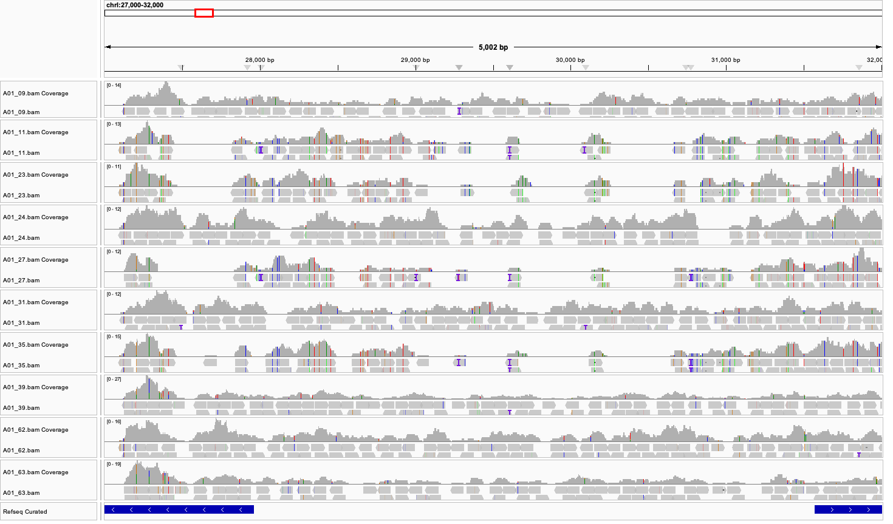

**Question 1.1:** Use ls `-lh` to compare the sizes of `A01_09.fq.gz`, `A01_09.sam`, and `A01_09.bam`. Why is the SAM file so much larger than the FASTQ file it came from? Why is the BAM file so much smaller than the SAM file?
- The SAM file is much larger than the FASTQ file because it is an uncompressed text file that stores not only the read sequences and quality scores, but also alignment information for every read, including genomic coordinates, FLAG values, CIGAR strings, mapping quality scores, mate information, and optional tags. The BAM file is much smaller than the SAM file because BAM is the compressed binary version of the same alignment data.

**Question 1.2**: `${my_sample}` appears four times in the `bwa mem` command. Write out that command exactly as bash would run it on the third trip through the loop, with every variable replaced by its value.
- `bwa mem -t 4 -R "@RG\tID:A01_23\tSM:A01_23" ../genomes/sacCer3.fa ../BYxRM/fastq/A01_23.fq.gz > A01_23.sam`

**Question 2.1:** What do the `@SQ` lines tell you, and how many are there?
- The `@SQ` lines describe the reference sequences (contigs/chromosomes) that were used for alignment. Each line gives a sequence name (`SN`) and its length in base pairs (`LN`). There are 17 `@SQ` lines: chromosomes I through XVI and the mitochondrial chromosome (`chrM`).

**Question 2.2:** Pick one alignment from the output above. What chromosome and position did it align to, and what is its CIGAR string? What does that CIGAR string mean?
- One output: `HWI-ST387_0114:5:47:16737:7355#0	0	chrI	29	60	76M	ACACCACACACCACACCACACCCACACACACACATCCTAACACTACCCTAACACAGCCCTAATCTAACCCTGGCCA	@FGDFGFGGDGGGGHHGHEHHHGHHHGFHHFFDC>DEEEEDDB<BE>?7?>C@@@@CDBDDF?E2FBDAA>361::	NM:i:0	MD:Z:76	AS:i:76	XS:i:22	RG:Z:A01_09`
- It aligned to chromosome I at position 29. Its CIGAR string was `76M`, meaning that all 76 bases of the read were aligned to 76 consecutive bases in the reference genome. 

**Question 2.3:** Your read group appears twice: once in the `@RG` header line, and once as an `RG:Z:` tag among the optional tags at the end of each alignment. Find both. Where did those values come from, and why does every single read need to carry one?
- The value came form the `-R` option used with `bwa mem`: `bwa mem -t 4 -R "@RG\tID:A01_09\tSM:A01_09"`. This creates the header line: `@RG	ID:A01_09	SM:A01_09` and assigns each alignment the optional tag: `RG:Z:A01_09`. The `@RG` line defines the read group, while the `RG:Z` tag links each individual read to that group. Every read needs this tag so that the downstream analysis programs can determine which sample it came from, especially when reads from multiple samples are analyzed together.

**Question 2.4:** What fraction of reads mapped to the reference genome? Is that a reasonable number for a yeast sample aligned to the yeast reference?
- 669,520 out of 669,548 reads mapped to the reference genome, corresponding to a mapping rate of 100.00%. This is a reasonable result because the reads came from Saccharomyces cerevisiae and were aligned to the S. cerevisiae sacCer3 reference genome.

**Question 2.5:** Several lines of the output are exactly 0, including “properly paired” and “with mate mapped to a different chr”. Why? What does that tell you about how this library was sequenced?
- The “properly paired” and “with mate mapped to a different chromosome” values are zero because this library was sequenced using single-end reads. Each DNA fragment produced only one read, so there is no mate read to evaluate for pairing, orientation, insert size, or chromosomal location.

**Question 2.6:** Looking at your 10 samples in this region, which ones appear to carry BY ancestry and which appear to carry RM ancestry? Find the markers at chrI:27915, chrI:28323, chrI:28652, and chrI:29667 in `~/Data/BYxRM/BYxRM_GenoData.txt` and check whether your visual call agrees with the published genotypes.

- Based on the IGV visualization of the `chrI:27,000-32,000` region, A01_11, A01_23, A01_27, and A01_35 appear to carry RM ancestry. A01_09, A01_24, A01_31, A01_39, A01_62, and A01_63 appear to carry BY ancestry.

- The published genotypes at all four markers agree with the visual classification: samples with RM ancestry have `R` genotypes, whereas samples with BY ancestry have `B` genotypes.

| Marker | A01_09 | A01_11 | A01_23 | A01_24 | A01_27 | A01_31 | A01_35 | A01_39 | A01_62 | A01_63 |
|---|---|---|---|---|---|---|---|---|---|---|
| chrI:27915 | B | R | R | B | R | B | R | B | B | B |
| chrI:28323 | B | R | R | B | R | B | R | B | B | B |
| chrI:28652 | B | R | R | B | R | B | R | B | B | B |
| chrI:29667 | B | R | R | B | R | B | R | B | B | B |